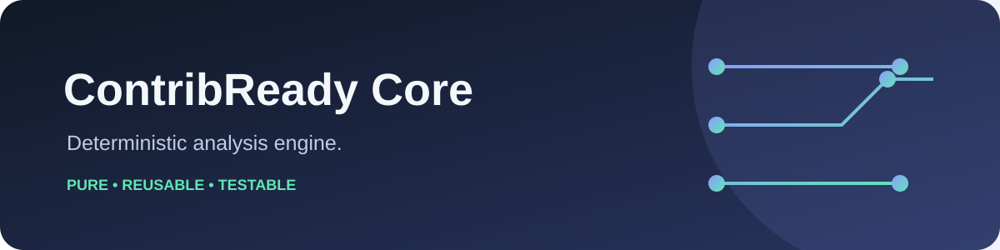
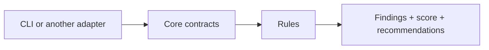

  

  
  
  

# @contribready/core

The reusable deterministic ContribReady engine. It owns evidence-neutral contracts, path classification, setup/testing/contribution/issue rule metadata and evaluation, weighted scoring, recommendations, findings, summaries, and reports. Its evidence index and rules are pure and receive file contents from an adapter; it has no CLI, filesystem, GitHub, HTTP, or target-repository execution dependency.

The product-level source of truth is maintained in the main [`contribready`](https://github.com/ContribReady/contribready) repository. Its architecture and rule documentation define how this package fits into the complete product. The user-facing executable lives in [`contribready-cli`](https://github.com/ContribReady/contribready-cli).

## What Core owns

- Evidence-neutral data contracts and deterministic classification
- Setup, testing, contribution, and issue-readiness rules
- Weighted scoring, findings, summaries, and recommendations
- Pure behavior that does not access files, GitHub, HTTP, or target-repository code

For contribution and support paths, see [CONTRIBUTING.md](CONTRIBUTING.md) and [SUPPORT.md](SUPPORT.md).

The npm package is not published yet. For local development, check out `contribready-core` and `contribready-cli` as sibling directories; the CLI currently links to this source checkout. From this repository, run `npm ci && npm run verify` to lint/typecheck, build and test, and validate the npm package contents without publishing. The v0.1 compatibility target is Node.js 20, 22, and 24 on Ubuntu, Windows, and macOS.

Phase 15 expands static evidence classification for Deno, Bun, uv/PDM, SBT/Gradle, Docker, Nix, and version/toolchain files. Classification remains pure and does not execute any ecosystem tooling.
